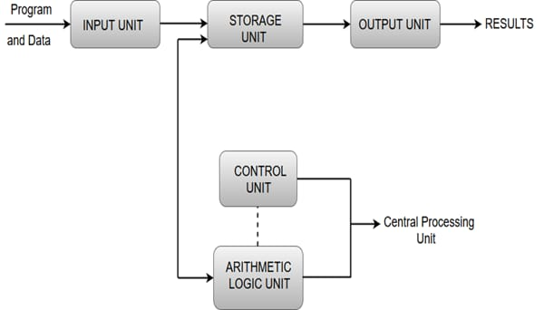
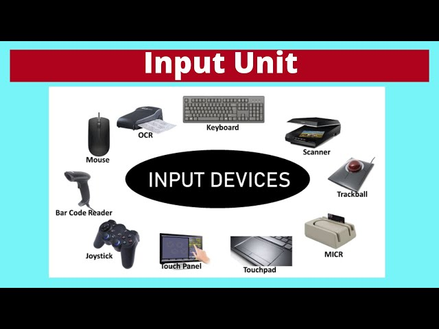
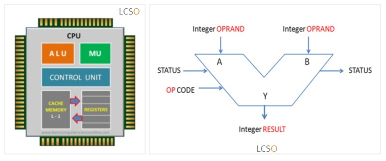
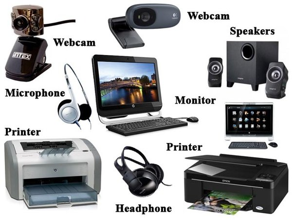
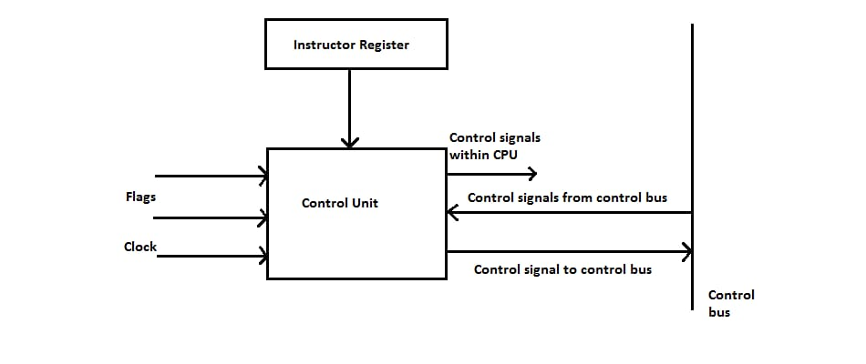

# Functional Units

In this fast-moving world, everyone tends to use computers, laptops for various needs in our day-to-day life. Tasks ranging from simple arithmetic calculations to complex simulations, data analysis, artificial intelligence algorithms, all are done by the computer. We give some tasks to the computer, and the computer works on it to give the output. Have you ever wondered how these functions take place in the computer? Computer being a combination of hardware and software, these two components integrate and work together to perform complex tasks. But how this works behind the computer? Let’s get to know about it in this article.

## What are functional units?

The computer follows a set of instructions to perform its assigned task, and these instructions are given by the functional units of a computer to each hardware component, and these hardware components execute the instructions given by the functional units of the computer. The functional units are part of the Central Processing Unit (CPU) of a computer, and they consist of five important components.

The five main functional units of a computer are listed below.

1. Input unit
2. Memory unit
3. Arithmetic logic unit
4. Output unit
5. Control unit.

Let us view each component in detail.

### INPUT UNIT

As the name suggests, the input unit uses input devices like keyboard, mouse, touchpad, etc., to get input from the user. The input unit reads the data entered by the user, so we can say that the function of the input unit is to read data. When the user gives a command or instruction to the computer, the input unit comes into play and reads the instruction and gets to know what is the command, what operation specified, and what needs to be performed by the computer to complete the given task.

### MEMORY UNIT

The instructions and commands fetched from the user need to be stored before executing it. The Memory Unit facilitates this need by storing the data and instructions along with the operation.

#### Primary Memory

Primary Memory is also known as Main Memory, which is nothing but the RAM, built into the CPU. Primary Memory is the heart of the Memory Unit. It has primary storage capacity; a large amount of data is stored in RAM. Primary Memory is used to store current data and instructions and has fast access time. Primary Memory is volatile memory, i.e., it does not retain information when the computer is turned off, and the data stored in this memory is expensive. Any location in this memory can be accessed in a short and fixed amount of time after specifying the address.

#### Secondary Memory

Secondary memory stores a large amount of data. The storage capacity of secondary memory is much greater than primary memory, while the time taken to access data from secondary memory is longer compared to accessing data from primary memory. The data stored in secondary memory is less expensive and permanent, i.e., when the data is present in the memory even when the computer is turned off, and data is retained without getting lost unless we delete it voluntarily.

Examples: Secondary storage devices like magnetic and optical disks (CD, DVD), Flash memory devices.

#### Cache Memory

Cache Memory stores the often-retrieved data or programs and data that are currently being executed. It is an adjunct to the main memory fabricated on the processor chip. It stores a small amount of data but has fast access time so data in Cache are fetched quickly compared to primary and secondary memory. Cache Memory is tightly coupled with the processor with a high instruction execution rate.

### ARITHMETIC AND LOGIC UNIT

Arithmetic Logic Unit is used to perform arithmetic and logical operations in the computer. The arithmetic operations include addition, subtraction, multiplication, division, comparing values. The logical operations include AND, OR, and NOT. The data and operators are stored in high-speed storage elements called registers, which are present in the CPU. The ALU takes the input data from these registers and processes it based on the instruction provided by the user and produces output, which is stored in another register. Nowadays, CPUs are manufactured in a way that ALU is highly optimized to increase its speed and efficiency by developing multiple parallel processing units and advanced techniques to improve the computer's performance. The architecture of the Arithmetic Logic Unit differs between processes, which make them have varying capabilities and performance levels. The width of data, supported operations, pipeline depth, parallelism, optimizations in ALU are some factors which make differences in the architecture of ALU between processors.

### OUTPUT UNIT

The Output Unit is nothing but the output devices like microphones, monitors, printers, headphones, etc., that are used to communicate data from computers to the user. The data from the computer is transferred to the user with the help of the Output Unit by converting the binary data from CPU to a form which humans can easily understand like audio, video, text, images, etc. These output data are displayed to users by the Output Unit. To be brief, once the CPU processes the instructions, the output is stored in binary form or in machine language in the CPU. The Output Unit converts this data to user understandable form and transfers it to the output devices for the user to access the output.

### CONTROL UNIT

It is a circuitry within the processor of the computer. Control Unit is the backbone of computers as it maintains all the processes taking place in the functional units of the CPU. It coordinates the tasks between them and helps in directing the operation of the processor. It directs the memory, ALU, input and output units on how to perform and execute the task assigned and controls all operations of the computer. The sequence of data transfers within the processor is coordinated by the Control Unit, i.e., the Control Unit controls the data flow in the processor. Control Units sequence the control signals based on the external instruction provided. The Control Unit is responsible for fetching, decoding, executing and storing the results. It sends control signals to other units and senses the states of each functional unit. The timing signals generated by Control Circuit governs the transfers and determines when a given action should take place. These timing signals manage the data transfers between the processor and memory. A set of control lines carries these signals. The control circuitry is physically distributed all over the computer.

 There are two types of Control Units,

1. Hard-Wired
2. Micro-Programmable Control Units.

Instruction registers, control signals, control bus, input flags and clock signals are the components of the Control Unit.

# FUTURISTIC APPLICATION OF FUNCTIONAL UNITS
## Brain-Computer Interfaces(BCIs)

In future, advancements in technology leads to development of direct communication between human brain and computers. Functional units would play a crucial role in processing neural signals from brain, and store these neural data and processing instructions in memory units and ALU perform the computations to analyse and interpret neural patterns. Output unit would generate the feedback based on brain activity and control unit would maintain and manage the overall operation of BCI system.